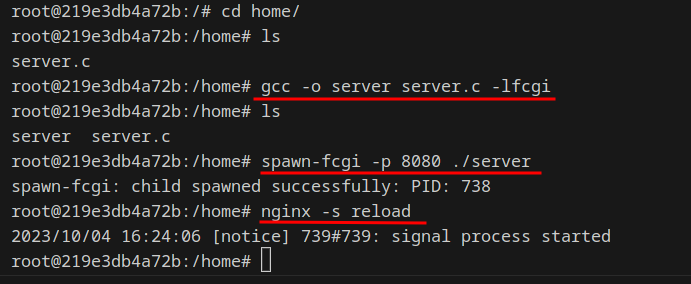

# Simple Docker
## Part 1. Готовый докер

### 1.1 Взять официальный докер образ с **nginx** и выкачать его при помощи `docker pull`

<br>*docker pull*<br>

### 1.2 Проверить наличие докер образа через `docker images`

<br>*docker images*<br>

### 1.3 Запустить докер образ через `docker run -d [image_id|repository]`

<br>*docker run -d nginx*<br>

### 1.4 Проверить, что образ запустился через `docker ps`

<br>*docker ps*<br>

### 1.5 Посмотреть информацию о контейнере через `docker inspect [container_id|container_name]`

<br>*docker inspect nginx*<br>

### 1.5.1 Размер контейнера

<br>*Container size*<br>

### 1.5.2 Список замапленных портов

<br>*Port*<br>

### 1.5.3 IP контейнера ba8aa0737c7b

<br>*Container IP*<br>

### 1.6 Остановить докер образ через `docker stop [container_id|container_name]` и проверить, что образ остановился через `docker ps`

 <br>*docker stop*<br>

### 1.7 Запустить докер с портами 80 и 443 в контейнере, замапленными на такие же порты на локальной машине, через команду *run*

<br>*docker run -d -p 80:80 -p 443:443 nginx*<br>

### 1.8 Проверить, что в браузере по адресу *localhost:80* доступна стартовая страница **nginx**

<br>*localhost:80*<br>

### 1.9 Перезапустить докер контейнер через `docker restart [container_id|container_name]`

<br>*docker restart id*<br>

### 1.10 Проверить любым способом, что контейнер запустился

<br>*docker ps*<br>


## Part 2. Операции с контейнером

### Прочитать конфигурационный файл *nginx.conf* внутри докер контейнера через команду *exec*

<br>*docker exec 8fbf0dca64b7 cat /etc/nginx/nginx.conf*<br>

### Создать на локальной машине файл *nginx.conf* и настроить в нем по пути */status* отдачу страницы статуса сервера **nginx**

<br>*ngnix.conf*<br>

### Скопировать созданный файл *nginx.conf* внутрь докер образа через команду `docker cp`
### Перезапустить **nginx** внутри докер образа через команду *exec*
### Проверить, что по адресу *localhost:80/status* отдается страничка со статусом сервера **nginx**

<br>*cp nginx conf & reload nginx*<br>

<br>*http://localhost/status*<br>

### Экспортировать контейнер в файл *container.tar* через команду *export*
### Остановить контейнер
### Удалить образ через `docker rmi [image_id|repository]`, не удаляя перед этим контейнеры

<br>*export-stop-rmi*<br>


### Удалить остановленный контейнер

<br>*dcoker rm*<br>

### Импортировать контейнер обратно через команду *import*

### Запустить импортированный контейнер

### Проверить, что по адресу *localhost:80/status* отдается страничка со статусом сервера **nginx**

<br>*import & run container.tar*<br>
<br>*localhost/status*<br>

## Part 3. Мини веб-сервер

### Написать мини сервер на **C** и **FastCgi**, который будет возвращать простейшую страничку с надписью `Hello World!`

<br>*server.c*<br>


```
gcc -o server server.c -lfcgi
```

### Написать свой *nginx.conf*, который будет проксировать все запросы с 81 порта на *127.0.0.1:8080*

<br>*config*<br>

### Запустить написанный мини сервер через *spawn-fcgi* на порту 8080
 - Для этого сначала запускаем контейнер, копируем конфигурационный файл и наш минисервер в контейнер, подкючаемся к контейнеру

<br>*docker run & docker cp & docker exec*<br>

 - Далее прописываем следующие команды для работы с сервером

``` brew
apt-get update
```
<br>*apt-get update*<br>


```
apt-get install gcc
```

<br>*apt-get install gcc*<br>

```
apt-get install spawn-fcgi
```

<br>*apt-get install spawn-fcgi*<br>

```
apt-get install libfcgi-dev
```

<br>*apt-get install libfcgi-dev*<br>


```
gcc -o server server.c -lfcgi

spawn-fcgi -p 8080 ./server

nginx -s reload
```
<br>*gcc & spawn-fcgi & nginx reload*<br>

### Проверить, что в браузере по *localhost:81* отдается написанная вами страничка

<br>*localhost:81*<br>


## Part 4. Свой докер

Теперь всё готово. Можно приступать к написанию докер образа для созданного сервера.

#### Написать свой докер образ, который:
### 1) собирает исходники мини сервера на FastCgi из [Части 3](#part-3-мини-веб-сервер)
### 2) запускает его на 8080 порту
### 3) копирует внутрь образа написанный *./nginx/nginx.conf*
### 4) запускает **nginx**

### Собрать написанный докер образ через `docker build` при этом указав имя и тег
 - Для этого напишем Dockerfile, также наш сркипт 

<br>*Dockerfile*<br>

<br>*script*<br>

- Собираем 

    <br>*build*<br>


### Проверить через `docker images`, что все собралось корректно

<br>*check image*<br>

### Запустить собранный докер образ с маппингом 81 порта на 80 на локальной машине и маппингом папки *./nginx* внутрь контейнера по адресу, где лежат конфигурационные файлы **nginx**'а (см. [Часть 2](#part-2-операции-с-контейнером))
### Проверить, что по localhost:80 доступна страничка написанного мини сервера

<br>*run.80.81*<br>

### Дописать в *./nginx/nginx.conf* проксирование странички */status*, по которой надо отдавать статус сервера **nginx**

<br>*add status*<br>

### Перезапустить докер образ

<br>*reload*<br>

*Если всё сделано верно, то, после сохранения файла и перезапуска контейнера, конфигурационный файл внутри докер образа должен обновиться самостоятельно без лишних действий*
### Проверить, что теперь по *localhost:80/status* отдается страничка со статусом **nginx**

<br>*localhost/status*<br>

## Part 5. **Dockle**

После написания образа никогда не будет лишним проверить его на безопасность. 

### Просканировать образ из предыдущего задания через `dockle [image_id|repository]`
 - Сначала устанавливаем *Dockle* https://github.com/goodwithtech/dockle 

 <br>*install.dockle*<br>


 - Сканируем 

  <br>*docle scan*<br>

### Исправить образ так, чтобы при проверке через **dockle** не было ошибок и предупреждений

 ```
 - export DOCKER_CONTENT_TRUST=1
  ```
Эта рекомендация предлагает включить Content Trust, что делает проверку подписей образов Docker, чтобы обеспечить их аутентичность.

 - Прописываем юзера 

 ```
USER nginx
```

 - Удаляем кэш после обновления

```
rm -rf /var/lib/apt/lists
```

 - Добавим HEALTHCHECK, который позволяет проверять состояние запущенного контейнера и определять, работает ли приложение внутри контейнера корректно
 ```
HEALTHCHECK --interval=5m --timeout=3s CMD curl http://localhost/ || exit 1
 ```
> выполняет проверку доступности локального HTTP-сервиса внутри контейнера по адресу http://localhost/. Если сервис доступен и отвечает успешно, контейнер считается здоровым. В противном случае он считается нездоровым и может быть перезапущен или обработан другим образом, зависящим от настроек контейнеризации.

[image_id|repository]

```
export DOCKER_CONTENT_TRUST=1
```

  <br>*Dockerfile*<br>

- Сканируем еще раз 

```
dockle -input 05_image.tar -i CIS-DI-0010
```

  <br>*dockle*<br>

  <br>*localhost*<br>


## Part 6. Базовый **Docker Compose**

Фухх.. 

!!Примечание!!
Перед выполнением данного шага необходимо установить утилиту [docker-compose], инструкция по установке [https://www.digitalocean.com/community/tutorials/how-to-install-and-use-docker-compose-on-ubuntu-20-04]

### Написать файл *docker-compose.yml*, с помощью которого:
### 1) Поднять докер контейнер из [Части 5](#part-5-инструмент-dockle) _(он должен работать в локальной сети, т.е. не нужно использовать инструкцию **EXPOSE** и мапить порты на локальную машину)_

### 2) Поднять докер контейнер с **nginx**, который будет проксировать все запросы с 8080 порта на 81 порт первого контейнера

### Замапить 8080 порт второго контейнера на 80 порт локальной машины

  <br>*docker-compose*<br>

  Контейнер будет запущен на порту 80 хост-машины, а порт 8080 контейнера будет использоваться внутр контейнера.

 

 <br>*nginx proxy config*<br>
  В конфигурации прописываем перенаправление на другой сервер.

 <br>*start nginx*<br>

Запуск сервера с бесконечным ожиданием завршения процессов.

 <br>*dockerfile_proxy_srever*<br>
 Это докер файл для  nginx.

### Остановить все запущенные контейнеры

 <br>*no_process*<br>

### Собрать и запустить проект с помощью команд `docker-compose build` и `docker-compose up`
### Проверить, что в браузере по *localhost:80* отдается написанная вами страничка, как и ранее

 <br>*docker-compose build*<br>

 docker-compose build создание  images

 <br>*docker-compose up && status*<br>

 docker-compose up -d запуск контейнеров плюс проверка работы сервера.